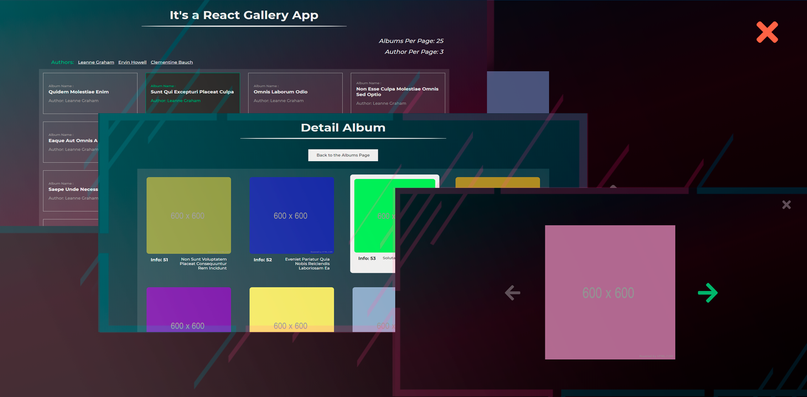

# React-ImageGallery Application
This app doesn't use any UI libs only pure css with React.js

The way it look's like) 👇🏼



# How to use it ?
 - Open the terminal and run ```npm i``` command to install node_modules
 - Then run ```npm run start``` command in order to run the project
 
### That's all :D

Copyright (c) 2020 Mark
